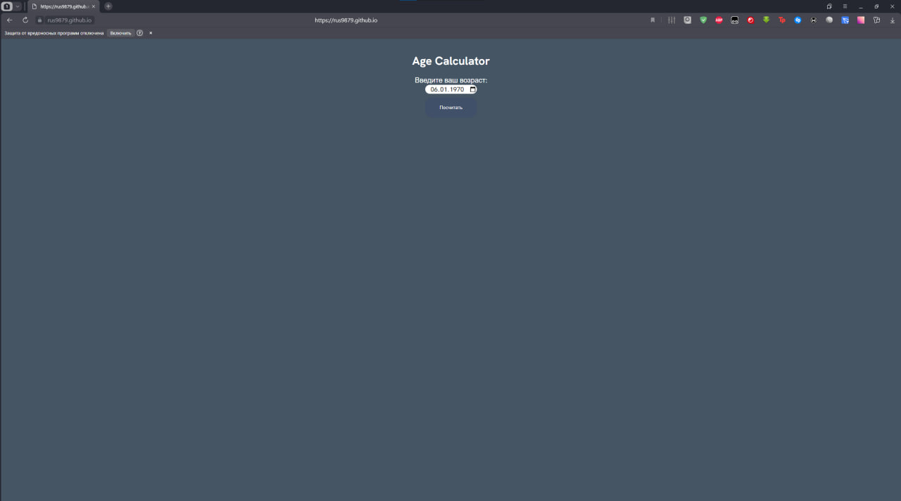

Приложение "Калькулятор возраста"

Это README файл для задания "Калькулятор возраста" от Frontend Mentor.

Описание
Приложение "Калькулятор возраста" - это веб-приложение, которое позволяет пользователям рассчитать свой возраст на основе введенной даты рождения. Оно предоставляет простой и интуитивно понятный пользовательский интерфейс, где пользователи могут ввести свою дату рождения и мгновенно увидеть свой возраст в годах, месяцах и днях.

